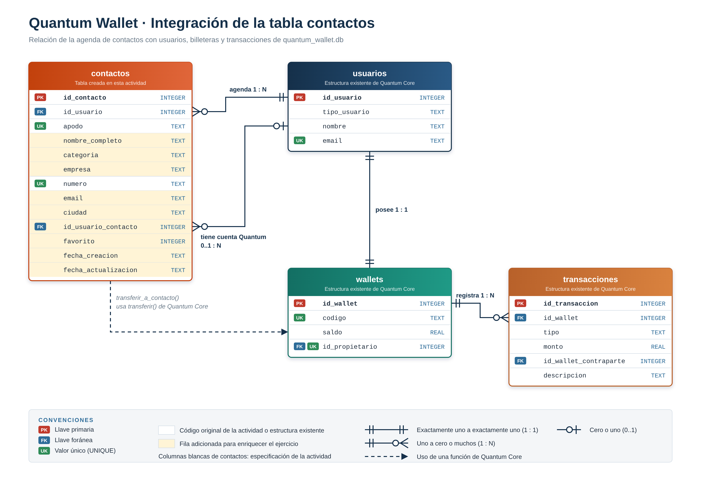

# Semana 7 · Actividad 2 — Operaciones CRUD en Quantum Core: agenda de contactos

Operaciones **CRUD** (Create, Read, Update, Delete) sobre la tabla `contactos` de
`quantum_wallet.db`, implementadas en `practica_crud.py` con una función por operación.

El trabajo parte del código original de la actividad (enunciado de Canvas y repositorio del curso):
tabla `contactos` vinculada al usuario por llave foránea, contactos para el usuario 1, lectura en
consola, cambio de apodo con `WHERE` y eliminación del contacto 2. Todo eso se conserva.
Para enriquecer el ejercicio, la tabla se convirtió en una **agenda profesional** (nombre completo,
categoría, empresa, correo y ciudad) con **diez contactos** del entorno laboral y personal, y se
**adicionaron** validación en dos capas, controles de seguridad, filtro y resumen por categoría,
búsqueda, favoritos, transferencias a un contacto con cuenta en Quantum Wallet y registro de
operaciones (`[AGREGADO]` en el código).



## Archivos

| Archivo | Contenido |
|---|---|
| `practica_crud.py` | Tabla `contactos` y operaciones CRUD (una función por operación) |
| `configurar_db.py` | Crea `quantum_wallet.db` con la estructura de Quantum Core (base de partida) |
| `quantum_wallet.db` | Base de datos SQLite con la tabla `contactos` |
| `crud_contactos.log` | Registro de la última ejecución: lo leído (R), actualizado (U) y eliminado (D) |
| `diagrama_er_contactos.drawio` | Diagrama de integración editable (Draw.io Integration en VS Code) |
| `diagrama_er_contactos.png` / `.svg` | Exportaciones del diagrama |
| `capturas/` | Evidencias de la ejecución y del antes y después en DB Browser for SQLite |
| `Semana7_Actividad2_CRUD_Contactos_Deibis_Zuluaga.pdf` | Informe técnico |

## Tabla `contactos`

| Campo | Tipo | Restricciones | Origen |
|---|---|---|---|
| `id_contacto` | INTEGER | PK AUTOINCREMENT | Original |
| `id_usuario` | INTEGER | NOT NULL · FK → `usuarios` ON DELETE CASCADE | Original |
| `apodo` | TEXT | NOT NULL · NOCASE · 1 a 40 caracteres · único por agenda | Original |
| `nombre_completo` | TEXT | NOT NULL · 3 a 80 caracteres | **Adicionado** |
| `categoria` | TEXT | FAMILIA, TRABAJO, PROVEEDOR, CLIENTE, SERVICIO o EMERGENCIA | **Adicionado** |
| `empresa` | TEXT | opcional | **Adicionado** |
| `numero` | TEXT | NOT NULL · solo dígitos · 3 a 15 · único por agenda | Original |
| `email` | TEXT | formato de correo | **Adicionado** |
| `ciudad` | TEXT | opcional | **Adicionado** |
| `id_usuario_contacto` | INTEGER | FK → `usuarios` ON DELETE SET NULL · distinto de `id_usuario` | **Adicionado** |
| `favorito` | INTEGER | 0 o 1 | **Adicionado** |
| `fecha_creacion` / `fecha_actualizacion` | TEXT | trazabilidad | **Adicionado** |

## Operaciones CRUD

| Operación | Función | Sentencia | Control |
|---|---|---|---|
| **C** · Create | `crear_contactos()` | `INSERT` con `executemany` | Valida todo antes; una sola transacción |
| **R** · Read | `leer_contactos()` | `SELECT … LEFT JOIN usuarios … WHERE id_usuario = ?` | Solo la agenda del usuario; filtro opcional por categoría |
| **U** · Update | `actualizar_apodo()` | `UPDATE … WHERE id_contacto = ? AND id_usuario = ?` | Una fila, del dueño; verifica `rowcount` |
| **D** · Delete | `borrar_contacto()` | `DELETE … WHERE id_contacto = ? AND id_usuario = ?` | Verifica que exista; borra una fila, nunca la tabla |

Funciones adicionadas: `actualizar_contacto()` (lista blanca de campos), `resumen_por_categoria()`, `buscar_contactos()`,
`transferir_a_contacto()`, validadores y `probar_seguridad()`.

> **Regla de oro**
> `UPDATE` y `DELETE` sin `WHERE` afectan **todas** las filas. Aquí el `WHERE` combina la llave
> primaria con el dueño de la agenda: se toca una sola fila y nunca la de otro usuario.

## Seguridad y validación

| Control | Implementación |
|---|---|
| Inyección SQL | Parámetros `?` en todas las consultas (probado con `1 OR 1=1` y `' OR '1'='1'`: 0 filas) |
| Validación en dos capas | Python (`validar_*`) y la base de datos (`CHECK`, `UNIQUE`, FK) |
| Autorización | `WHERE … AND id_usuario = ?` en UPDATE y DELETE |
| Lista blanca | Solo `apodo`, `numero`, `email` y `favorito` son editables |
| Trazabilidad | `logging` en consola y en `crud_contactos.log` |

Resultado de las pruebas: **13 de 13 operaciones inválidas rechazadas**.

## Cómo ejecutar

```bash
python3 configurar_db.py               # crea quantum_wallet.db
python3 practica_crud.py               # ejecuta el CRUD completo
python3 practica_crud.py --pausas      # se detiene tras C, U y D para revisar DB Browser
```

**Salida esperada (resumida):**

```
--- C - CREATE
C - Create: 10 contactos insertados para el usuario 1
--- R - READ
R - Read: 10 contactos del usuario 1
       id  apodo                nombre completo                categoria  numero      ciudad
        1  Contador             Andrés Felipe Restrepo Ospina  PROVEEDOR  3104458721  Medellín
        2  Antiguo arrendador   Jorge Iván Cardona Ruiz        SERVICIO   6045612233  Rionegro
       ...
Resumen de la agenda del usuario 1 por categoria: PROVEEDOR 3, TRABAJO 3, CLIENTE 1, ...
--- U - UPDATE
U - Update: contacto 1 'Contador' -> 'Contador y revisor fiscal' (1 fila modificada)
--- D - DELETE
D - Delete: contacto 2 'Antiguo arrendador' (Jorge Iván Cardona Ruiz, 6045612233) eliminado (1 fila)
--- INTEGRACION CON QUANTUM CORE
Transferencia de 150,000.00 a 'Laura - Desarrollo' registrada en Quantum Core
--- SEGURIDAD Y VALIDACION
Resultado: 13 de 13 operaciones invalidas rechazadas
```

> **DB Browser for SQLite**
> Si `configurar_db.py` vuelve a crear la base mientras DB Browser la tiene abierta, el programa
> sigue mostrando la versión anterior. Use *Close Database* y *Open Database* para ver la nueva.
